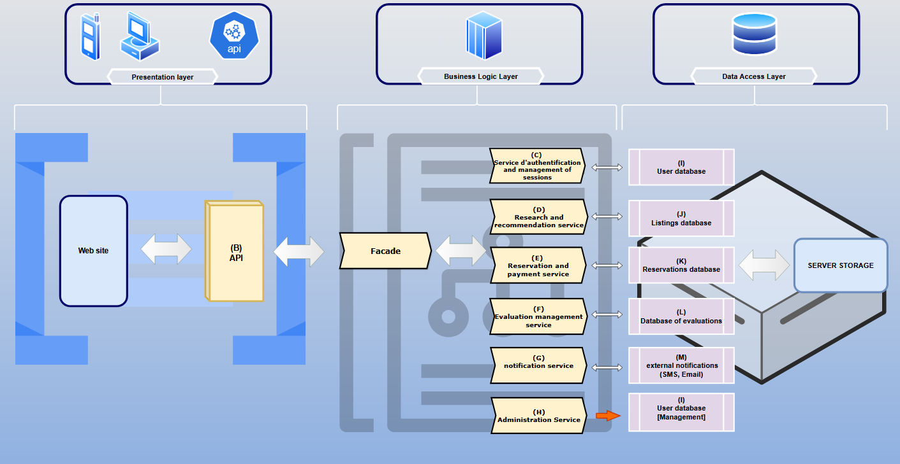
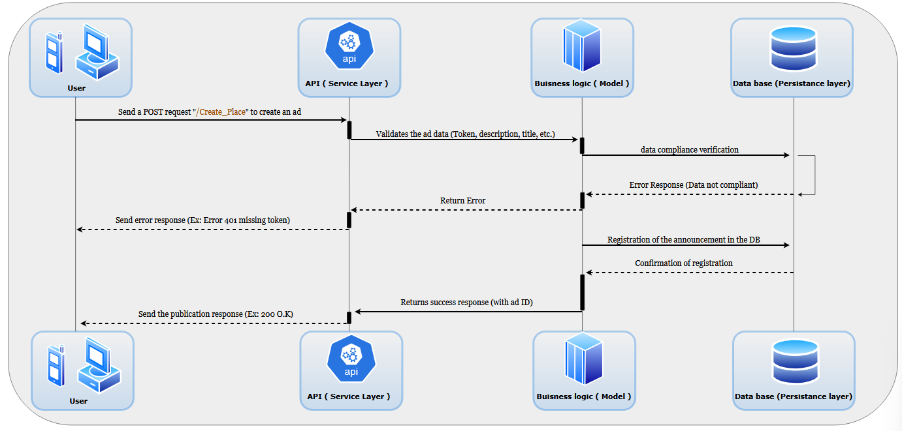
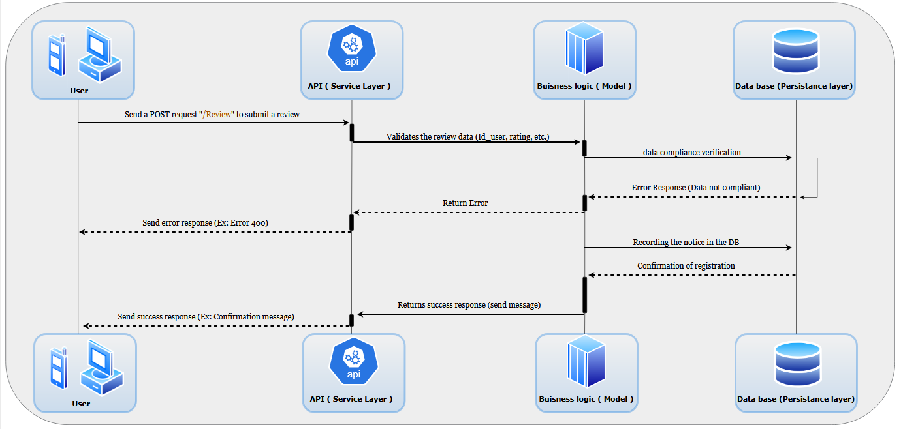
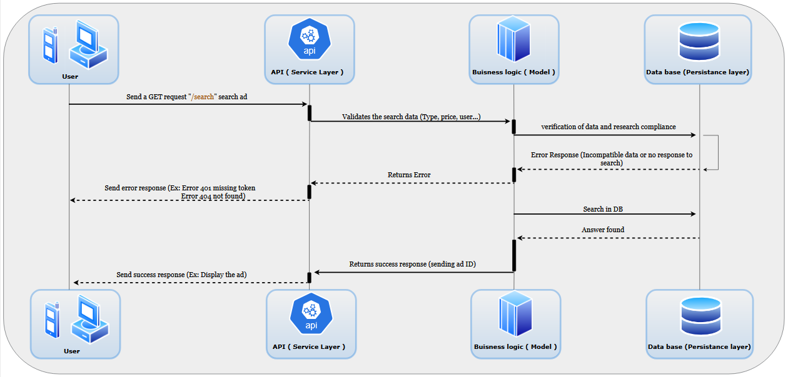

# HBnB UML Project

## Table of Contents
1. [Introduction](#introduction)
2. [High-Level Architecture](#high-level-architecture)
    - [Presentation Layer](#presentation-layer)  
    - [Business Logic Layer](#business-logic-layer)  
    - [Data Access Layer](#data-access-layer)  
3. [Business Logic Layers](#business-logic-layers)
    - [BaseModel](#basemodel)
    - [User Class](#user-class)
    - [Place Class](#place-class)
    - [Review Class](#review-class)
    - [Amenity Class](#amenity-class)
4. [API Interaction Flow](#api-interaction-flow)
    - [User Registration](#user-registration)
    - [Place Creation](#place-creation)
    - [Review Submission](#review-submission)
    - [Fetching Places List](#fetching-places-list)
5. [Conclusion](#conclusion)
6. [Authors](#authors)

## Introduction

This document serves as a comprehensive technical blueprint for the HBnB project. It compiles all diagrams and explanatory notes created during the design phase, providing a clear reference for the system's architecture and design. This documentation will guide the implementation phases and serve as a valuable resource through the project.

### Purpose and Scope

The purpose of this document is to:
- Present a cohesive overview of the HBnB project's architecture
- Provide detailed insights into the system's design decisions
- Offer a clear understanding of component interactions and data flow
- Serve as a reference guide for developers during implementation

## High-Level Architecture

### High-Level Package Diagram

### Explanation
This section describes the layered architecture and facade pattern used in the HBnB project. It outlines the main components and their interactions at a high level.

### Presentation layer

Components :

- Website: The user-facing interface that enables interaction with the system through a graphical UI.
- API: Exposes endpoints for external clients or other systems to interact with the business logic.

Responsibilities :

- Handles user interactions and requests.
- Communicates with the Business Logic Layer through the API.

Conclusion :

- This layer is kept distinct to enable multiple clients to interact with the system while ensuring flexibility. The API ensures standardized communication with the backend.

### Business Logic Layer

Components :

- Facade: A simplified interface that provides a unified way to interact with complex business operations.
- Services: Contain the actual business logic and interact with the Data Access Layer.

Responsibilities :

- Implements core business rules and workflows.
- Provides a structured way to handle requests from the Presentation Layer.
- Delegates data-related operations to the Data Access Layer.

Conclusion :

- This layer ensures that all business rules are centralized, making it easier to modify and extend functionalities without affecting other layers.

#### Implementation of the Facade Pattern
The Facade Pattern is applied in this layer through the Facade Component, which:

- Exposes a simple and unified interface to the Presentation Layer.
- Internally communicates with multiple service components to handle complex workflows.
- Reduces dependencies between layers, making the system more maintainable.

### Data Access Layer

Components :

- Data Management : Handles direct interactions with the database.

Responsibilities :

- Handles database operations while hiding the details from other layers.
- Ensures data integrity and optimized access patterns.

Conclusion :

- By keeping data operations separate, we ensure that the Business Logic Layer remains independent of the underlying data source, allowing for easy modifications (e.g., changing the database technology).

## Business Logic Layers

### Detailed Class Diagram

### Explanation
This section presents the detailed class diagram for the Business Logic Layer, explaining the entities, their relationships, and how they fit into the business logic of the application.

#### BaseModel
- Purpose: Serves as the parent class for other models, providing shared attributes and methods.
- Common Attributes :
    - id : A unique identifier for each instance.
    - created_at : Timestamp of when the object was created.
    - updated_at : Timestamp of the last update.
- Common Methods :
    - save() : Updates the updated_at timestamp when modifications occur.
    - to_dict() : Converts an object’s data into a dictionary format for easy serialization.
#### User Class
- Inherits from: BaseModel
- Purpose : Represents users interacting with the system.
- Attributes :
    - name : The user's name.
    - email : The user’s email (unique).
    - password : Encrypted password for authentication.
- Methods :
    - authenticate(email, password) : Verifies user login credentials.
#### Place Class
- Inherits from: BaseModel
- Purpose : Represents a rental place or listing.
- Attributes :
    - name : Name of the place.
    - location : Address or geographic coordinates.
    - price_per_night : Rental cost per night.
    - owner : A reference to a User who owns the place.
- Methods :
    - calculate_total_price(nights) : Returns the total cost for a given stay duration.
#### Review Class
- Inherits from: BaseModel
- Purpose : Represents reviews given by users for a place.
- Attributes :
    - user : A reference to the User who wrote the review.
    - place : A reference to the Place being reviewed.
    - rating : A numerical rating (e.g., 1-5 stars).
    - comment : Text feedback from the user.
- Methods :
    - is_valid_rating() : Ensures the rating is within the allowed range.
#### Amenity Class
- Inherits from: BaseModel
- Purpose : Represents extra features a place can offer (e.g., Wi-Fi, pool, parking).
- Attributes :
    - name: Name of the amenity (e.g., "Wi-Fi", "Air Conditioning").
- Methods :
    - No complex business logic; mainly used for categorization and filtering.

#### Class diagrams use several types of arrows to represent relationships between classes :

- Association (solid line): Represents a basic relationship between classes.

- Directed Association (solid line with arrowhead): Indicates a stronger, one-way relationship.

- Aggregation (empty diamond): Represents a "has-a" relationship where the parts can exist independently of the whole.

- Composition (filled diamond): Represents a stronger "contains" relationship where the parts cannot exist without the whole.

- Dependency (dashed line with arrowhead): Indicates that one class uses another, but doesn't store it as an attribute.

- Inheritance/Generalization (solid line with triangle arrowhead): Represents an "is-a" relationship between a superclass and subclass.

- Realization (dashed line with triangle arrowhead): Shows that a class implements an interface.

## API Interaction Flow

### Explanation
This section includes sequence diagrams for selected API calls, providing explanations of the interactions and data flow between components.

### User Registration

#### API Call :
- POST /api/users/register

#### Sequence of Interactions :
1. Client sends a POST request with user details (name, email, password).
2. API Controller validates the input data and sends it to the Facade Layer.
3. Facade Layer calls the User Service, which checks if:
    - The email is unique.
    - The password meets security standards.
4. User Service hashes the password before saving the user in the Data Access Layer.
5. Database inserts the new user record and returns a success response.
6. User Service constructs a response, omitting sensitive details (e.g., password).
7. API Controller returns a 201 Created response to the client with the new user’s details (excluding password).

### Place Creation

#### API Call :
- POST /api/places

#### Sequence of Interactions :

1. Client sends a POST request with the place details (name, location, price, owner ID).
2. API Controller validates the request data and sends it to the Facade Layer.
3. Facade Layer calls the Place Service, which verifies business logic (e.g., valid owner ID, required fields).
4. Place Service sends a request to the Data Access Layer to store the new place in the database.
5. Database inserts the new place record and returns a success response.
6. Place Service constructs a response and sends it back through the Facade Layer to the API Controller.
7. API Controller returns a 201 Created response to the client with the new place’s details.

### Review Submission

#### API Call :
- POST /api/reviews

#### Sequence of Interactions :

1. Client sends a POST request with the review details (user ID, place ID, rating, comment).
2. API Controller validates the request and sends it to the Facade Layer.
3. Facade Layer calls the Review Service, which checks:
    - If the user has stayed at the place before allowing a review.
    - If the rating is within the valid range (e.g., 1-5 stars).
4. Review Service sends the validated review to the Data Access Layer to store it in the database.
5. Database inserts the review and returns a success confirmation.
6. Review Service constructs a response and forwards it back through the Facade Layer to the API Controller.
7. API Controller returns a 201 Created response to the client.

### Fetching Places List

#### API Call :
- GET /api/places

#### Sequence of Interactions :

1. Client (Web/App/API Consumer) sends a GET request to fetch a list of places.
2. API Controller receives the request and send it to the Facade Layer.
3. Facade Layer interacts with the Place Service, which retrieves data from the Data Access Layer (Database).
4. Database returns the list of places to the Place Service.
5. Place Service sends the formatted data back to the Facade Layer.
6. Facade Layer forwards the response to the API Controller.
7. API Controller returns the list of places as a JSON response to the client.

#### Sequence diagrams use arrows to represent messages between objects :

- Synchronous Message (solid line with filled arrowhead): Indicates that the sender waits for a response before continuing6.

- Asynchronous Message (solid line with open arrowhead): Shows that the sender continues without waiting for a response6.

- Reply Message (dashed line with open arrowhead): Represents the return of information from the receiver to the sender6.

- Create Message (dashed line with open arrowhead): Indicates the creation of a new object9.

- Destroy Message (solid line with X at the end): Represents the destruction of an object9.

## Conclusion

This technical document provides a comprehensive overview of the HBnB project's architecture and design. It serves as a crucial reference for the implementation phase, ensuring that all team members have a clear understanding of the system's structure and functionality.

As the project progresses, this document may be updated to reflect any changes or refinements in the design. All team members are encouraged to refer to this document regularly and contribute to its maintenance and improvement.

## Authors

[Gaetan Pineiro](https://github.com/THO-Gaetan)\
[Aurelien Goaoc](https://github.com/Aurelien292)