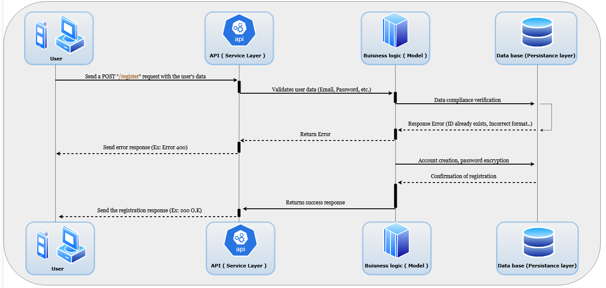

# HBnB UML Project

## Table of Contents
1. [Introduction](#introduction)
2. [High-Level Architecture](#high-level-architecture)
3. [Business Logic Layer](#business-logic-layer)
4. [API Interaction Flow](#api-interaction-flow)

## Introduction

This document serves as a comprehensive technical blueprint for the HBnB project. It compiles all diagrams and explanatory notes created during the design phase, providing a clear reference for the system's architecture and design. This documentation will guide the implementation phases and serve as a valuable resource through the project.

### Purpose and Scope

The purpose of this document is to:
- Present a cohesive overview of the HBnB project's architecture
- Provide detailed insights into the system's design decisions
- Offer a clear understanding of component interactions and data flow
- Serve as a reference guide for developers during implementation

## High-Level Architecture

### High-Level Package Diagram

### Explanation
This section describes the layered architecture and facade pattern used in the HBnB project. It outlines the main components and their interactions at a high level.

## Business Logic Layer

### Detailed Class Diagram

### Explanation
This section presents the detailed class diagram for the Business Logic Layer, explaining the entities, their relationships, and how they fit into the business logic of the application.

#### Class diagrams use several types of arrows to represent relationships between classes :

- Association (solid line): Represents a basic relationship between classes4.

- Directed Association (solid line with arrowhead): Indicates a stronger, one-way relationship14.

- Aggregation (empty diamond): Represents a "has-a" relationship where the parts can exist independently of the whole14.

- Composition (filled diamond): Represents a stronger "contains" relationship where the parts cannot exist without the whole14.

- Dependency (dashed line with arrowhead): Indicates that one class uses another, but doesn't store it as an attribute47.

- Inheritance/Generalization (solid line with triangle arrowhead): Represents an "is-a" relationship between a superclass and subclass45.

- Realization (dashed line with triangle arrowhead): Shows that a class implements an interface4.

## API Interaction Flow

### Sequence Diagrams for API Calls

### Explanation
This section includes sequence diagrams for selected API calls, providing explanations of the interactions and data flow between components.

#### Sequence diagrams use arrows to represent messages between objects :

- Synchronous Message (solid line with filled arrowhead): Indicates that the sender waits for a response before continuing6.

- Asynchronous Message (solid line with open arrowhead): Shows that the sender continues without waiting for a response6.

- Reply Message (dashed line with open arrowhead): Represents the return of information from the receiver to the sender6.

- Create Message (dashed line with open arrowhead): Indicates the creation of a new object9.

- Destroy Message (solid line with X at the end): Represents the destruction of an object9.

## Conclusion

This technical document provides a comprehensive overview of the HBnB project's architecture and design. It serves as a crucial reference for the implementation phase, ensuring that all team members have a clear understanding of the system's structure and functionality.

As the project progresses, this document may be updated to reflect any changes or refinements in the design. All team members are encouraged to refer to this document regularly and contribute to its maintenance and improvement.
